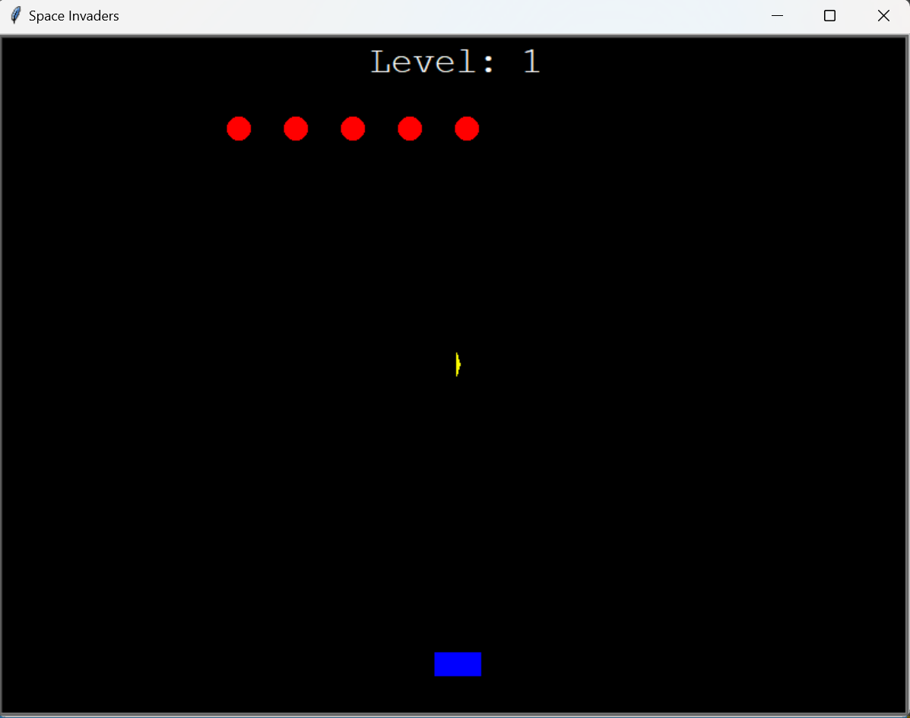

# Space Invaders Game

## Description
A classic shoot 'em up game built using Python's turtle graphics module. Defend your spaceship against waves of alien ships. As you progress, the game becomes more challenging!



## Features
- Move your spaceship left and right to dodge incoming alien ships.
- Fire bullets to destroy the alien ships.
- As you advance through levels, the number of alien ships increases, ramping up the difficulty.
- Custom graphics for the spaceship, bullets, and alien ships.

## How to Play
1. Use the left and right arrow keys to move your spaceship.
2. Press the spacebar to fire a bullet.
3. Destroy all alien ships to advance to the next level.

## Requirements
- Python 3.x
- turtle module (comes built-in with Python)


## Installation
1. Clone the repository:
```
git clone https://github.com/MariosAvraam/space-invaders.git
```

2. Navigate to the project directory:
```
cd space-invaders
```

## Usage
Run the game:
```
python main.py
```

## Contributing

Pull requests are welcome. For major changes, please open an issue first to discuss what you would like to change.

## License
This game is open-source and free to use.

Enjoy the game and may the force be with you!

